# Группа 3
# Задание 1
## Задание
Нужно с помощью PHP или XSLT создать 3 функции для управления данными в XML.
XML файл должен иметь 3+ уровневую структуру. Он должен содержать данные о "Юзере" (Как я понял),
который должен состоять из след. полей: Id, Login, Role, Name, Second Name, LastTimeOnline и Status
## Решение
С помощью PHP было сделано 4 функции для добавления, удаления и изменения записи в XML документе, а так же сортировка по столбику Status.
Был создан класс Database, 
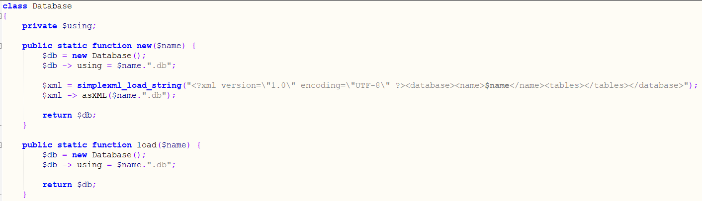  
Который отвечает за:
* Добавление "таблиц"  
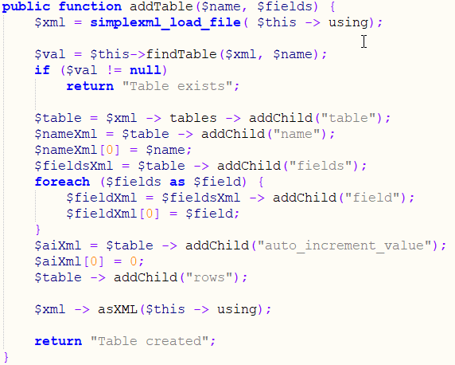  
* Добавление данных в таблицы  
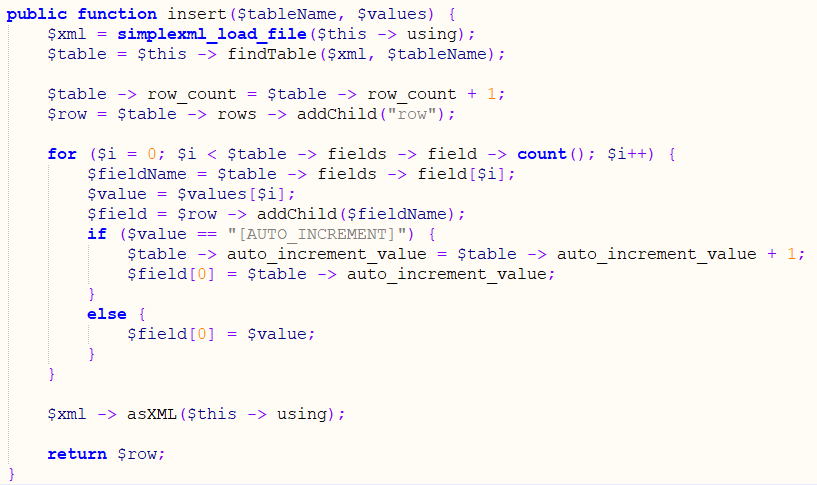  
* Удаление данных в таблицы  
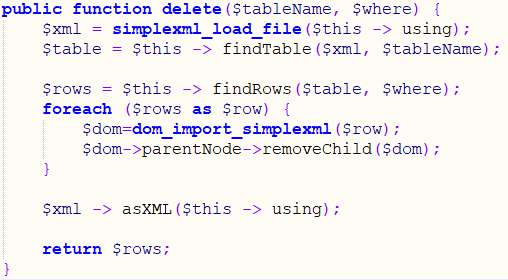  
* Изменение данных в таблицы  
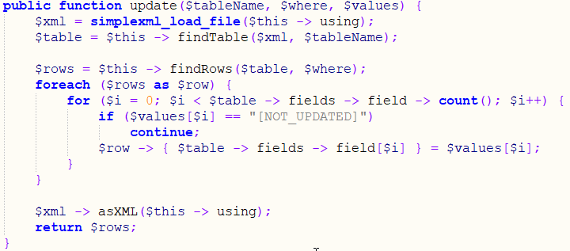  
* Получение данных в таблицы  
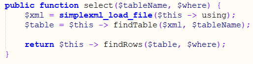  
Функции выше вызывают дополнительные функции для того, чтобы меньше повторять код:  
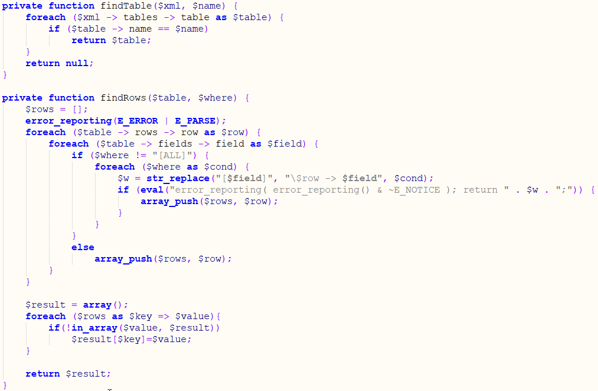  
## Использование класса Database
Так как скриншоты и так много места в этом файле забирают, зайдите в папку Task_1 и там будет открытый код всех файлов
Ссылка на "активную" страницу - https://ljaljakudrjavtsev17.thkit.ee/Task_1/index.php
# Задание 2
## Задание
Нужно создать проект на ASP.NET MVC Web Api для "управления" проектами. Нужно, чтобы пользователь мог зарегистрироваться и залогинится на сайте. У пользователей должно быть 2 роли - Админ и юзер. Обычный юзер должен иметь возможность добавлять задачи к проектам, просматривать добавленные собой задачи и, если задача еще не была отклонена/принята, изменять ее и удалять. Админ должен иметь возможность добавлять проекты и задачи, принимать или отклонять задачи и так же изменять роль/удалять юзеров. Так же требуется использование AJAX.
## Что получилось
### Юзеры
Пользователи могут зарегистрироваться, после чего к ним на указаную почту придет письмо активации. После того, как пользователь был активирован, он может зайти на сайт и с помощью меню Tasks добавлять задачи и просматривать добавленные собой задачи. Так же они могут изменять свое имя и фамилию.
### Админы
Изначально создается админ с логином/паролем admin/admin, админ так же, как и обычный пользователь, может добавлять задачи и просматривать свои задачи через меню Tasks, но так же у него есть меню Admin Panel, где есть ссылка на все остальные таблицы. Нажав на Admin Panel, вас перекинет на страницу, где будет написано, сколько задач со статусом Waiting... (Ожидает ответа) и 4 ссылки на другие страницы. Нажав на ссылку New task requests вас перекинет на страницу, где можно просмотреть подробную информацию о задаче и решить - принять ее или отклонить. Все страницы таблиц похожи друг на друга - есть форма поиска, добавления, изменения, пагинация и таблица с записями и кнопками удаления/изменения записи. Нажав на кнопку изменения открывается форма изменения с данными выбранной записи. Нажав на кнопку удаления запись будет моментально удалена. Слегка отличается страница таблицы юзеров - нет формы изменения и добавления, нельзя снять админа с/удалить себя же. Можно удалять и менять роль остальных юзеров.
## Сценарий
Админ заходит на сайт и добавляет новый проект, указывая его название, время начала и конца проекта.
 
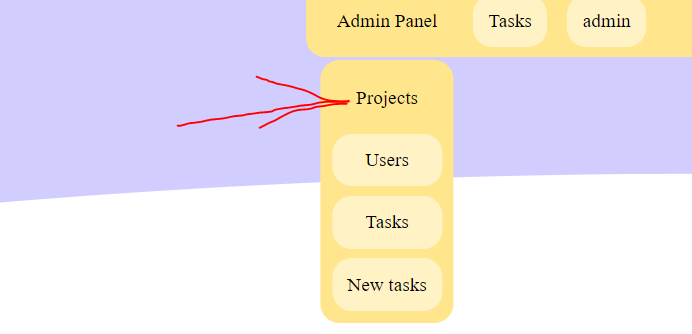  
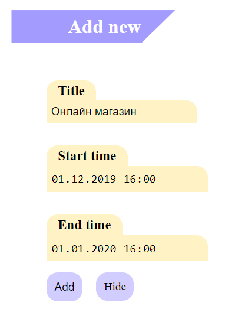  
 
После того, как админ добавил новый проект, пользователи могут добавлять задачи к проекту. Пользователь зашел на сайт, перешел на страницу запроса и создал новую задачу.
 
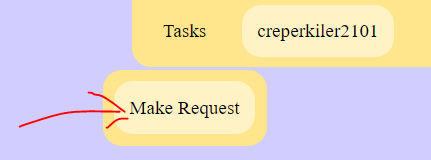  
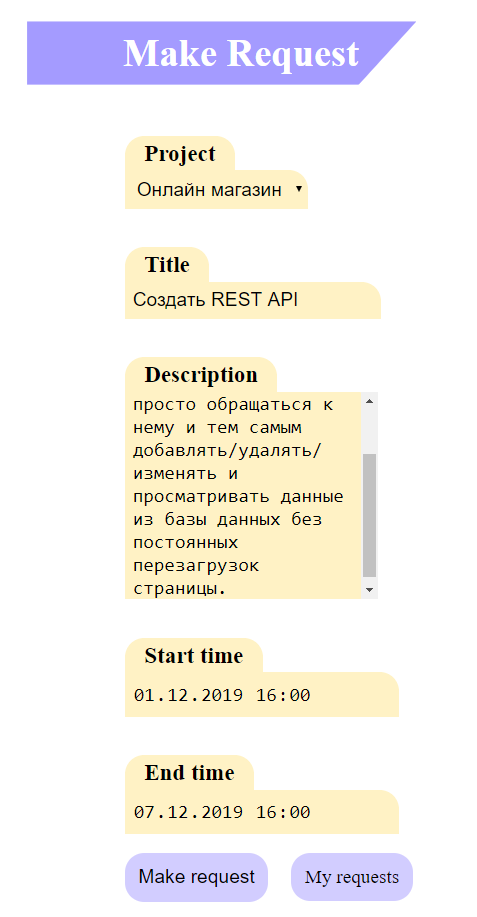  
 
После того, как пользователь создал запрос, админ должен принять или отклонить данный запрос. Админ заходит на сайт, переходит на страницу панели админа и видит, что есть новый/е запросы. Он переходит по ссылке и видит новую задачу, которую он решает отклонить т.к. он думает, что REST API сюда плохо подходит.
 
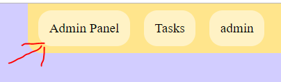  
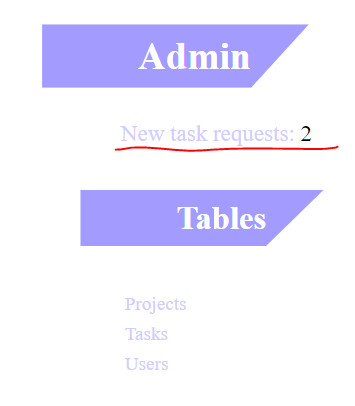  
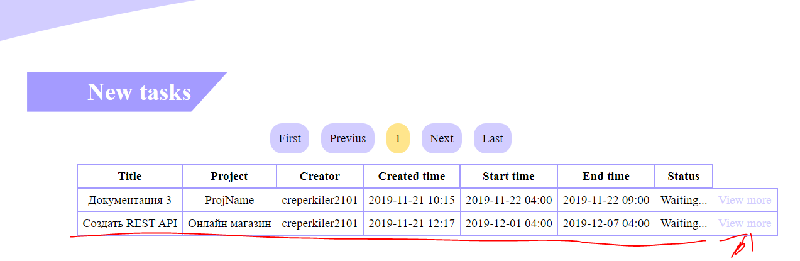  
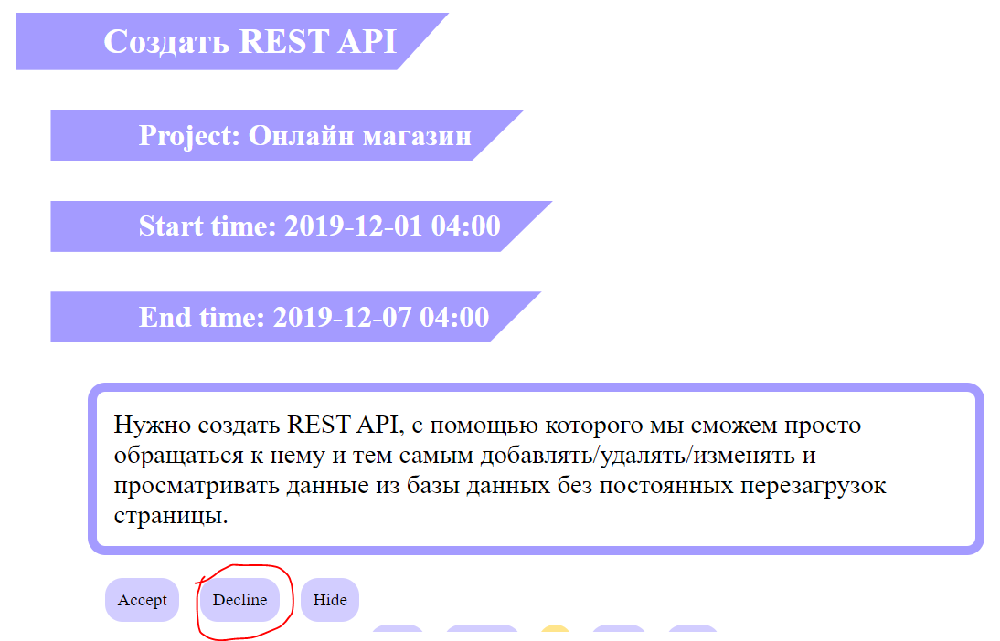  
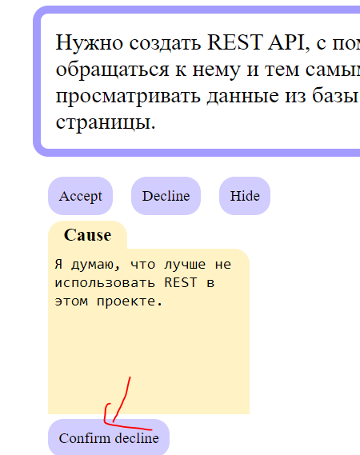  
 
После этого пользователю, который добавил задачу, приходит письмо на почту с сообщением о том, что его задачу отклонили
 
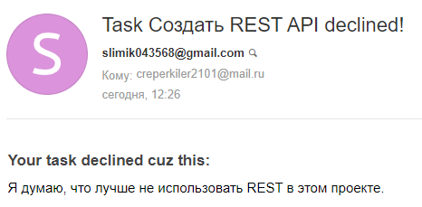  
 
Просто и быстро
